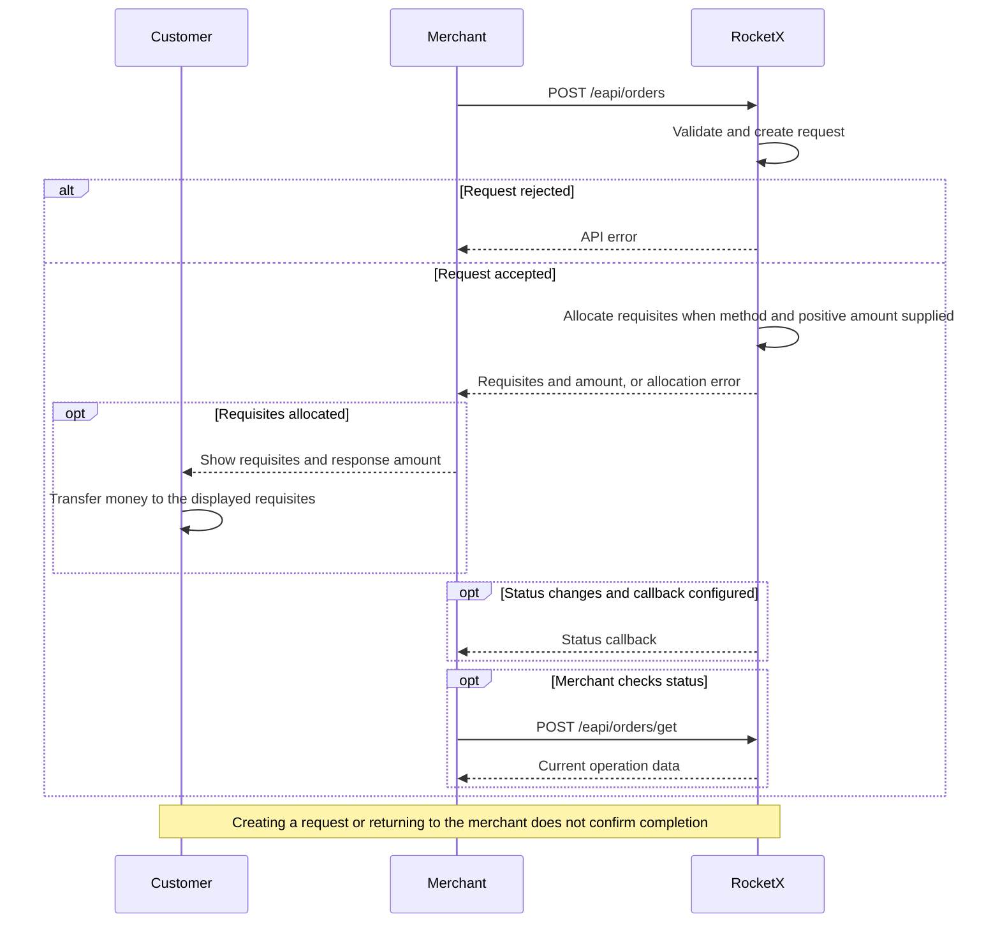

# Venezuela / VES: Order / H2H

## Integration Flow



## HTTP Request
```http
POST /eapi/orders
Content-Type: application/json
```

The request must be signed. See [Signature](./signature.md).

## Request Body

Use the exact `payment_type` tag enabled for your merchant, currency, and
operation. Availability is configured separately for orders and withdraws.
The tags in the examples are illustrative; replace them with your enabled tags.

```json
{
  "user_cid": "client-1",
  "currency": "VES",
  "payment_type": "VESVES",
  "amount": 100.55,
  "cid": "order-128",
  "merchant_cid": "merchant-2",
  "description": "Order description",
  "fio": "Juan Garcia",
  "fingerprint": "customer-fingerprint",
  "callback_url": "https://merchant.example/callbacks/orders",
  "form_options": {
    "redirect_url": "https://merchant.example/orders/order-128"
  }
}
```

## Request Parameters

| Parameter | Type | Required | Description |
|---|---:|:---:|---|
| `user_cid` | string | Yes | Customer ID in the partner system. |
| `currency` | string | Yes | Use `VES`. |
| `payment_type` | string | Yes for H2H | Payment method tag enabled for the merchant. Required to allocate requisites without using the hosted form. |
| `amount` | number | Yes | Positive fiat amount. A zero amount does not allocate requisites for H2H. |
| `cid` | string | Yes | Unique order ID in the partner system. |
| `merchant_cid` | string | No | Merchant-side identifier from the partner system. |
| `description` | string | No | Order description. |
| `fio` | string | No | Customer full name when required by the selected flow or payment method. |
| `fingerprint` | string | Yes | Customer fingerprint used to identify the same customer across accounts. |
| `callback_url` | string | No | URL where RocketX sends order status callbacks. |
| `enable_amount_increment_logic` | boolean | No | Accepted request field. Use only if this option is enabled for the merchant. |
| `form_options` | object | No | Hosted form options. |
| `phone_number` | string | No | Customer phone number when required by the selected payment method. |

## Successful Response

```json
{
  "status": "in_work",
  "amount": 100.55,
  "order_id": "430551eecdb8ecb842621cce",
  "requisites": {
    "phone_number": "04121234567",
    "document_number": "V-1234567",
    "bank": "0134 - BANESCO BANCO UNIVERSAL, C.A",
    "fio": "Juan Garcia"
  },
  "timer": 1788603300,
  "form_uri": "https://uragan.cash/external/orders/430551eecdb8ecb842621cce",
  "canceled_reason": ""
}
```

| Parameter | Type | Description |
|---|---:|---|
| `status` | string | Current order request status. |
| `amount` | number | Final amount assigned to the order. |
| `order_id` | string | RocketX order ID. |
| `requisites` | object, null | Payment requisites. Returned when requisites are allocated. |
| `timer` | integer, null | Countdown deadline as a Unix timestamp in seconds. `0` means no countdown; `null` means no associated order. |
| `form_uri` | string | Hosted payment page URL. |
| `canceled_reason` | string | Cancel reason code. Empty unless the order is canceled. |

## VES Requisites

The `requisites` object depends on the selected VES payment method.

| Payment method type | Requisites fields |
|---|---|
| VES mobile payment | `phone_number`, `document_number`, `bank`, `fio` |
| Account number only | `account_number` |
| Other card/account methods | `number`, `bank`, `fio` |

These rows describe response shapes, not values to send as `payment_type`
or a list of methods enabled for your merchant.

## Error Responses

See [Errors](./errors.md) for authentication, validation and business error responses.

## Track an Order

[Get Order Status](./order-status.md) or receive [callbacks](./callback.md).
