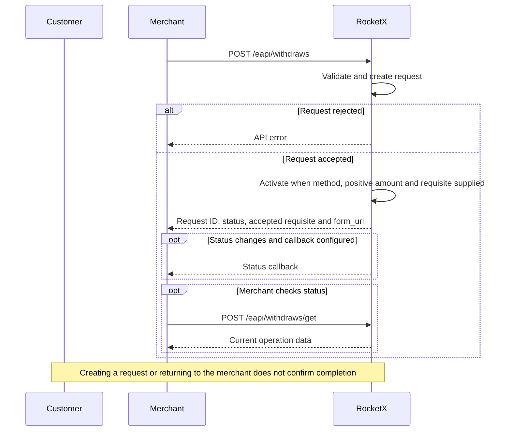
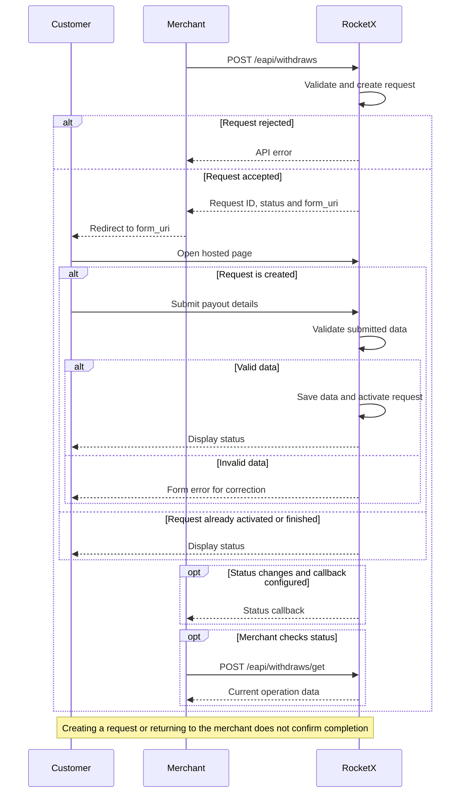

# Venezuela / VES: Withdraw

Create a VES withdraw when RocketX must process a payout to customer requisites.

## Flow Options

### H2H



### Redirect




## HTTP Request

```http
POST /eapi/withdraws
Content-Type: application/json
```

The request must be signed. See [Signature](./signature.md).

## Request Body

Use the exact `payment_type` tag enabled for your merchant, currency, and
operation. Availability is configured separately for orders and withdraws.
The tags in the examples are illustrative; replace them with your enabled tags.

```json
{
  "user_cid": "client-1",
  "currency": "VES",
  "payment_type": "VESVES",
  "amount": 100.55,
  "cid": "withdraw-128",
  "merchant_cid": "merchant-2",
  "description": "Withdraw description",
  "fingerprint": "customer-fingerprint",
  "requisite": {
    "phone": "04121234567",
    "document_number": "V-1234567",
    "bank": "BANESCO BANCO UNIVERSAL, C.A",
    "fio": "Juan Garcia"
  },
  "callback_url": "https://merchant.example/callbacks/withdraws",
  "form_options": {
    "redirect_url": "https://merchant.example/withdraws/withdraw-128"
  }
}
```

## Request Parameters

| Parameter | Type | Required | Description |
|---|---:|:---:|---|
| `user_cid` | string | Yes | Customer ID in the partner system. |
| `currency` | string | Yes | Use `VES`. |
| `payment_type` | string | Conditional | Payment method tag enabled for the merchant. Required when `requisite` is non-empty. |
| `amount` | number | Yes | Fiat amount. Use `0` only when amount selection is expected on the hosted page. |
| `cid` | string | Yes | Unique withdraw ID in the partner system. |
| `merchant_cid` | string | No | Merchant-side identifier from the partner system. |
| `description` | string | No | Withdraw description. |
| `fingerprint` | string | Yes | Customer fingerprint used to identify the same customer across accounts. |
| `requisite` | object | No | Customer payout requisite. If omitted, the customer can provide details on the hosted page. |
| `callback_url` | string | No | URL where RocketX sends withdraw status callbacks. |
| `form_options` | object | No | Hosted form options. |

## VES Requisite

```json
{
  "requisite": {
    "phone": "04121234567",
    "document_number": "V-1234567",
    "bank": "BANESCO BANCO UNIVERSAL, C.A",
    "fio": "Juan Garcia"
  }
}
```

| Parameter | Type | Required | Description |
|---|---:|:---:|---|
| `phone` | string | Yes | Venezuelan phone number in `0XXXXXXXXXX` format. |
| `document_number` | string | Yes | Customer document number, for example `V-1234567`. |
| `bank` | string | Yes | Bank name or bank code with name. |
| `fio` | string | Yes | Customer full name. Maximum 100 characters. |

Supported phone operator codes are `412`, `414`, `415`, `416`, `422`, `424`,
and `426`.

## Successful Response

```json
{
  "status": "active",
  "withdraw_id": "430551eecdb8ecb842621cce",
  "requisite": {
    "phone": "04121234567",
    "document_number": "V-1234567",
    "bank": "0134 - BANESCO BANCO UNIVERSAL, C.A",
    "fio": "Juan Garcia"
  },
  "form_uri": "https://uragan.cash/external/withdraws/430551eecdb8ecb842621cce",
  "canceled_reason": ""
}
```

If `payment_type`, a positive `amount`, and `requisite` are provided, the
withdraw can be returned with `active` status. If requisite data must be entered
on the hosted page, the withdraw is returned with `created` status.

## Get Withdraw Status

```http
POST /eapi/withdraws/get
Content-Type: application/json
```

Find the withdraw by RocketX `withdraw_id` or by partner `cid`.

```json
{
  "withdraw_id": "430551eecdb8ecb842621cce"
}
```

The response contains the full withdraw data, including `status`, `currency`,
`payment_type`, `requisite`, amounts, commission, timestamps, partner IDs, and
`form_options`.

### Response Example

Illustrative amounts, rates and timestamps; actual values depend on the operation and merchant configuration.

```json
{
  "withdraw_id": "430551eecdb8ecb842621cce",
  "cid": "withdraw-128",
  "status": "in_work",
  "canceled_reason": "",
  "currency": "VES",
  "payment_type": "VESVES",
  "requisite": {
    "phone": "04121234567",
    "document_number": "V-1234567",
    "bank": "0134 - BANESCO BANCO UNIVERSAL, C.A",
    "fio": "Juan Garcia"
  },
  "amount_in_currency": 100.55,
  "rate": 1,
  "full_amount": 100.55,
  "commission": 0,
  "amount": 100.55,
  "created_at": "2026-09-05T10:00:00.000Z",
  "updated_at": "2026-09-05T10:05:00.000Z",
  "description": "Withdraw description",
  "merchant_cid": "merchant-2",
  "user_cid": "client-1",
  "fingerprint": "customer-fingerprint",
  "callback_url": "https://merchant.example/callbacks/withdraws",
  "form_options": {
    "redirect_url": "https://merchant.example/withdraws/withdraw-128"
  }
}
```
